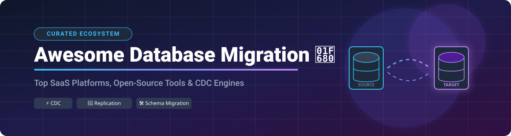

# Awesome Database Migration 🚀

## 📌 Top Database Migration Platforms & Open-Source Tools Ecosystem ⚡

**A Comprehensive, SEO-Optimized & Curated Ecosystem Guide of Enterprise SaaS Products, Cloud Migration Services, CDC Engines & Open-Source Database Tools**

*Covering Database Migration, Zero-Downtime Replication, Change Data Capture (CDC), Schema Versioning, and Cross-Engine ETL Pipelines.*

---

### 🌐 Sector Overview & Market Dynamics

> **Market Size & Valuation**: The global Database Migration and Data Integration market is estimated at **~$13.5 Billion** and is projected to expand at a CAGR of **15.2%**, reaching over **$32 Billion by 2032**.
> 
> **Industry Structure**: The sector is **moderately fragmented**. While hyper-scaler cloud providers (AWS, Azure, Google Cloud) and legacy integration giants control high-volume cloud migrations, the rapid rise of specialized CDC engines, open-source schema managers, and modern cloud database CI/CD platforms maintains a vibrant ecosystem with space for innovation.

---

## 🗂 Table of Contents

- [☁️ SaaS & Hosted Platforms](#️-saas--hosted-platforms)
- [📦 Open-Source GitHub Projects](#-open-source-github-projects)
- [🤝 How to Contribute](#-how-to-contribute)
- [⚠️ Disclaimer](#️-disclaimer)
- [💖 Support & Sponsorship](#-support--sponsorship)
- [📈 Star History](#-star-history)

---

## ☁️ SaaS & Hosted Platforms

Below is a curated comparison table of leading commercial and cloud-native database migration services, sorted in **descending order by company valuation/revenue**.

| Platform | Description & Key Features | Company Size / Valuation | Starting Paid Tier Pricing 💳 | Free Tier & Free Trial Limits 🎁 |
| :--- | :--- | :--- | :--- | :--- |
| **[AWS Database Migration Service (DMS)](https://aws.amazon.com/dms/)** ☁️ | Homogeneous & heterogeneous database migrations with continuous CDC. Integrates with AWS SCT for schema conversion. | **~$100B+ ARR** *(AWS Division)* | **$0.018/hour** (for `dms.t3.micro` replication instance) | **750 hours/month** of `dms.t3.micro` instance + 50 GB SSD for 12 months (or $100 credit for new accounts) |
| **[Google Database Migration Service](https://cloud.google.com/)** 🌐 | Cloud-native migration for MySQL, PostgreSQL, and SQL Server to Cloud SQL & AlloyDB with minimal downtime. | **~$35B+ ARR** *(Google Cloud)* | **$0.00/hour** for homogeneous moves; target DB instance billed separately | **100% Free** for homogeneous migrations to Cloud SQL; GCP $300 new-user credits apply |
| **[Azure Database Migration Service](https://azure.microsoft.com/)** 🟦 | Managed migration service for SQL Server, MySQL, PostgreSQL, and MongoDB to Azure Cloud data platforms. | **~$35B+ ARR** *(Azure Division)* | **$0.37/vCore-hour** (Premium Tier) | **Free Standard Tier**; Premium Tier free for **183 days** (up to 4 vCores) |
| **[Qlik Replicate](https://www.qlik.com/)** 🔄 | Enterprise continuous CDC and automated replication across 30+ databases with real-time logging (formerly Attunity). | **~$10B Valuation** ($1B ARR) | **~$1,200/month** (Enterprise subscription / custom quote) | **30-Day Free Trial** with full enterprise features & setup support |
| **[Fivetran HVR](https://www.fivetran.com/)** 🚀 | Enterprise-grade log-based CDC and high-volume data replication supporting complex hybrid environments. | **~$10B Valuation** ($600M Combined ARR) | **$1.00/credit** (Free plan available; Pay-as-you-go starting ~$60/month) | **14-Day Free Trial** with unlimited volume & continuous CDC pipelines |
| **[Striim](https://www.striim.com/)** ⚡ | Real-time streaming data integration and sub-60 second latency CDC platform for operational databases. | **~$1B Valuation** | **$0.60/vCPU-hour** (Striim Cloud Pay-as-you-go) | **Free Developer Edition** (up to 10 Million events/month) |
| **[Bytebase Cloud](https://bytebase.com/)** 🛡️ | Database CI/CD and DevOps management platform offering automated schema migration, SQL review, and access control. | **~$150M Valuation** | **$20/user/month** (Pro Tier) | **Free Forever Community Tier** (up to 20 database instances & unlimited users) |
| **[Ispirer Toolkit](https://www.ispirer.com/)** 🧰 | Automated cross-engine database and application code migration toolkit for legacy systems (Oracle, DB2, Sybase). | **~$25M Valuation** | **$495/month** (Light Edition per project) | **30-Day Free Trial** with full migration assessment report generation |
| **[DBConvert](https://dbconvert.com/)** 🔄 | Cross-database migration and bi-directional synchronization tool supporting over 40 database engines. | **~$10M Valuation** | **$179 one-time** (Perpetual personal license for 1 DB pair) | **Free Demo Mode** (transfers up to 50 records per table for validation) |
| **[Flyway Enterprise](https://www.red-gate.com/)** 🦅 | Commercial edition of Flyway with undo migrations, drift detection, code review, and automated rollbacks. | **~$250M Valuation** *(Redgate)* | **$1,495/user/year** (Flyway Enterprise License) | **Free Forever Community Edition** (Basic schema migration for open-source DBs) |

---

## 📦 Open-Source GitHub Projects

Explore production-proven, open-source database migration repositories, CDC engines, and schema management tools. Sorted in **descending order by GitHub star count** 🌟.

| Repository | Description & Primary Use Case | GitHub Stars 🌟 |
| :--- | :--- | :--- |
| **[Flyway](https://github.com/flyway/flyway)** 🦅 | **Developer-friendly SQL-first schema migration framework.** Supports 50+ relational databases using plain versioned SQL scripts. |  |
| **[golang-migrate](https://github.com/golang-migrate/migrate)** 🐹 | **Database migrations written in Go.** CLI and library supporting CLI/Go migrations for PostgreSQL, MySQL, SQLite, MongoDB, Redshift, etc. |  |
| **[Bytebase](https://github.com/bytebase/bytebase)** 🛡️ | **Open-source Database CI/CD tool for DevOps teams.** Offers SQL audit, schema migration, backup/restore, and role-based access control. |  |
| **[Debezium](https://github.com/debezium/debezium)** ⚡ | **The industry standard for low-latency log-based Change Data Capture (CDC).** Stream changes from PostgreSQL, MySQL, MongoDB, Oracle, and SQL Server to Kafka. |  |
| **[GH-OST](https://github.com/github/gh-ost)** 🐙 | **GitHub's online schema-migration tool for MySQL.** Triggerless, asynchronous, pauseable online schema migrations at enterprise scale. |  |
| **[Liquibase](https://github.com/liquibase/liquibase)** 💧 | **Enterprise cross-database migration & changelog management tool.** Supports SQL, XML, YAML, and JSON formats across 60+ database engines. |  |
| **[Atlas](https://github.com/ariga/atlas)** 🗺️ | **Modern declarative schema management tool by Ariga.** Inspect, plan, and execute database migrations using HCL configuration or pure SQL. |  |
| **[Dbmate](https://github.com/amacneil/dbmate)** 🛠️ | **Lightweight, framework-agnostic database migration tool.** Works with MySQL, PostgreSQL, SQLite, and ClickHouse across environments. |  |
| **[pgloader](https://github.com/dimitri/pgloader)** 🐘 | **High-performance data migration tool for PostgreSQL.** Migrates MySQL, SQLite, MS SQL Server, and CSV files into PostgreSQL in a single command. |  |
| **[Ape-DTS](https://github.com/apecloud/ape-dts)** 🦀 | **Ultra-fast data transfer suite written in Rust.** Performs high-throughput replication between MySQL, PostgreSQL, Redis, MongoDB, Kafka, and ClickHouse. |  |
| **[pg_chameleon](https://github.com/the4thdoctor/pg_chameleon)** 🦎 | **MySQL to PostgreSQL real-time replica system written in Python.** Replicates schema and data continuously via MySQL binary logs. |  |
| **[ReplicaDB](https://github.com/osalvador/ReplicaDB)** 🔄 | **Open-source tool for bulk data transfer between relational and non-relational databases.** Built for high-volume database migrations. |  |
| **[pglogical](https://github.com/2ndQuadrant/pglogical)** 🐘 | **Logical replication extension for PostgreSQL.** Provides high-speed logical replication, cross-version upgrades, and selective schema copy. |  |
| **[rsync-ai](https://github.com/rsync-ai/rsync)** 🤖 | **AI-powered open-source data pipeline platform.** Supports 21 connectors, Debezium CDC, batch extraction, and workflow scheduling. |  |
| **[Evolve](https://github.com/lecaillon/Evolve)** ⚡ | **Database migration framework for .NET applications.** Inspired by Flyway, using plain SQL scripts for cross-platform .NET deployment. |  |

---

## 🤝 How to Contribute

We welcome community contributions! Follow these simple steps:

1. **Fork** the repository.
2. Edit `README.md` to add your recommended SaaS or Open-Source tool (ensure accurate pricing, star counts, and descriptions).
3. Ensure formatting adheres to the tables above.
4. Open a **Pull Request** with a brief summary of additions.

---

## ⚠️ Disclaimer

- This list is **community-curated** for research and educational purposes.
- Always review security, encryption, compliance, and throughput requirements when executing production database migrations.

---

## 💖 Support & Sponsorship

If you find this repository helpful for your database engineering projects, data platform builds, or cloud migrations, please consider supporting the project!

- ⭐ **Star** this repository to show your appreciation.
- 🔀 **Fork** and share with your team or community.
- ☕ **Sponsor the Maintainer**: [Buy a coffee & support future updates via GitHub Sponsors](https://github.com/sponsors/ishandutta2007)

---

## 📈 Star History

---

Made with ❤️ for Database Engineers, Data Platform Teams, & DevOps Specialists worldwide.

